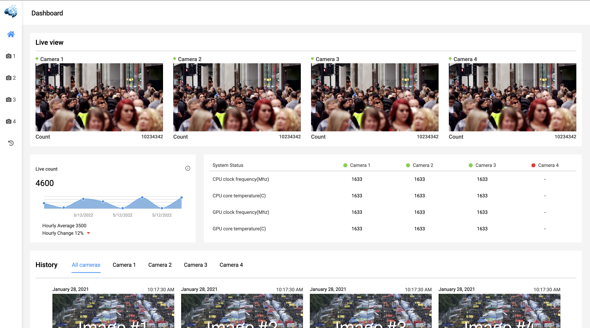
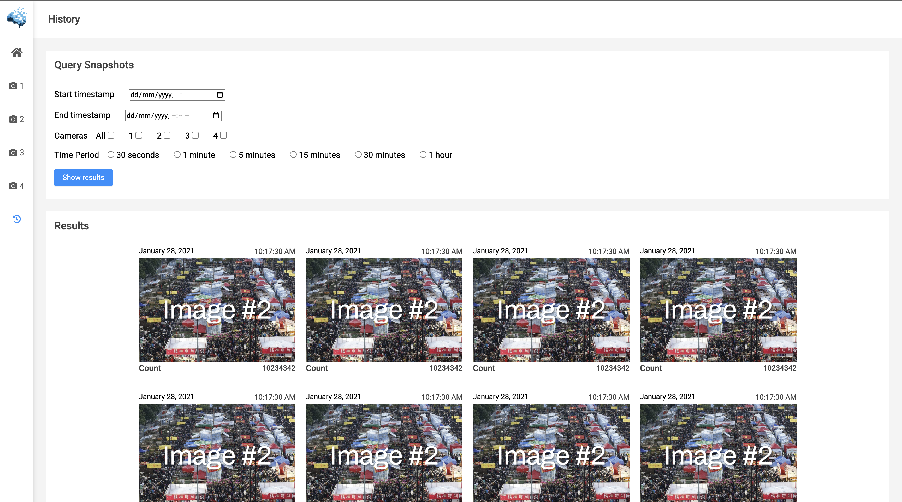

# CCTV-Dashboard

CCTV-Dashboard is a dashboard designed to view your surveillance station. This repository provides the frontend in a responsive format. It contains four main pages:

1. Login
2. Dashboard
3. Camera
4. History

## Preview
Here's a sneak peek of the dashboard:

### Dashboard


### Camera


### History


## Getting Started

Follow these steps to get the dashboard up and running:

1. **Clone the project**
   
   ```bash
   git clone git@github.com:bmuzuraimov/CCTV-Dashboard.git
   ```

2. **Navigate to the project directory**

   ```bash
   cd ./CCTV-Dashboard
   ```

3. **Install the necessary packages**

   ```bash
   npm i
   ```

4. **Run the server**

   ```bash
   npm start
   ```

   Once the server is running, you can access the dashboard on your browser at `http://localhost:3000`.

## Contribution

If you'd like to contribute to this project, please follow the conventional method of forking the repository, creating a new branch for your feature/fix, and then submitting a pull request.

